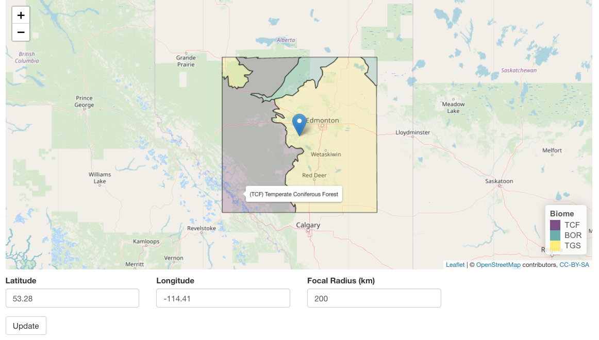

shiny-biomes
============

A Shiny app to identify the biomes/ecoregions in the vicinity of any given site. Use the app online at [https://patrickbarks.shinyapps.io/biomes/](https://patrickbarks.shinyapps.io/biomes/).

